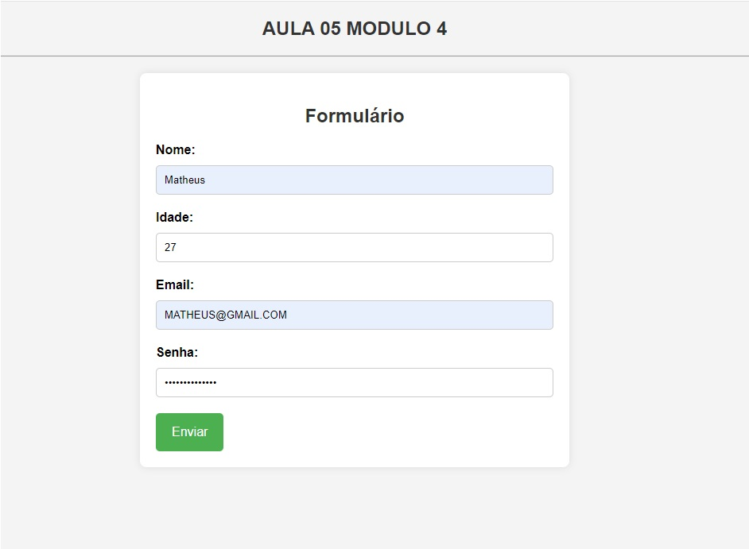

# Tutorial de Criação de Formulários e Armazenamento com PHP e XAMPP

Um tutorial simples para aprender a criar e processar formulários HTML com PHP e armazenar dados em um servidor local usando o XAMPP. Módulo 04 do curso B7Web - PHP, com incrementações minhas.

## Pré-requisitos

- XAMPP instalado no seu sistema.
- Conhecimento básico de HTML, PHP e SQL.

## Executando o Projeto

1. Abra o navegador e acesse `http://localhost/nome_do_projeto/index.php`.
2. Preencha o formulário e envie os dados.
3. Os dados serão processados pelo script PHP `recebedor.php` e armazenados no servidor local.

## Adicionando uma Imagem

## Contribuições

Contribuições são bem-vindas! Se encontrar problemas ou tiver sugestões de melhoria, abra uma issue ou envie um pull request.

## Autor

Curso B7Web.

## Licença

Este projeto está licenciado sob a [Licença MIT](https://opensource.org/licenses/MIT).
